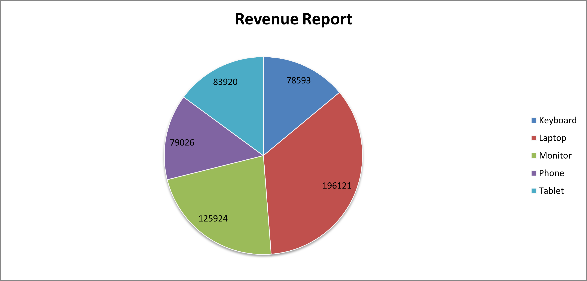

# 📊 Excel-Based Sales Reporting Automation

This Python-based automation tool reads raw sales data and generates summary reports with visual charts in Excel using configurable settings. It supports multiple chart types like bar, column, pie, and scatter — perfect for sales teams, business analysts, or freelance reporting jobs.

---

## 🧰 Features

- 📑 Read multiple Excel files/sheets
- 🔄 Generate dynamic pivot reports
- 📊 Create visual charts (bar, column, pie, scatter)
- 🕒 Timestamped filenames for version control
- ⚙️ JSON-based config for defining multiple report types
- 🗃️ Modular structure (charts, pivoting, I/O as reusable utils)

---

## 📸 Sample Output

### 🔹 Revenue Report (Bar Chart)


### 🔹 Revenue Report (Scatter Chart)


### 🔹 Revenue Report (Pie Chart)


### 🔹 Sales Report (Column Chart)


---

## 🚀 How to Run

```bash
pip install -r requirements.txt
python sales_analysis.py --config config.json
```

---

## 🧾 Configurable Report Example

```json
{
  "input_path": "./input_files",
  "output_path": "./output_files",
  "reports": [
    {
      "sheet_name": "Revenue Report",
      "group_by": "Product",
      "agg_column": "Revenue",
      "agg_func": "sum",
      "chart": "bar",
      "x_axis": "Product",
      "y_axis": "Revenue count",
      "title": "Revenue Report",
      "series_name": "Revenue trend"
    }
  ]
}
```

---

## 📦 Project Structure

```
.
├── sales_analysis.py
├── config.json
├── requirements.txt
├── input_files/
│   └── sales_data_for_charts.xlsx
├── output_files/
│   └── summary_YYYYMMDD_HHMMSS.xlsx
├── utils/
│   ├── charts.py
│   ├── pivot.py
│   └── excel_io.py
├── media/
│   └── Revenue_report_bar_chart.png
│   └── Revenue_report_scatter_chart.png
│   └── Revenue_report_pie_chart.png
│   └── Sales_report_column_chart.png
```

---

## 💼 Use Cases

| Audience         | Use Case Example |
|------------------|------------------|
| 🔸 Sales Teams     | Product-wise revenue and unit sales dashboards |
| 🔸 Freelancers     | Automate Excel chart reports for clients |
| 🔸 Project Managers| Create weekly/monthly KPI summary files |
| 🔸 QA Analysts     | Adapt structure for defect and aging reports |
| 🔸 Finance Teams   | Visualize cost center-based metrics |

---

## 🙌 Author

**Mark Pakkianathan**  
📫 [LinkedIn Profile](https://www.linkedin.com/in/mark-pakkianathan/)  
📂 Available for freelance reporting and automation projects
